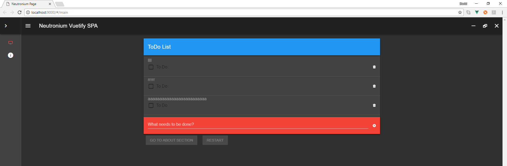
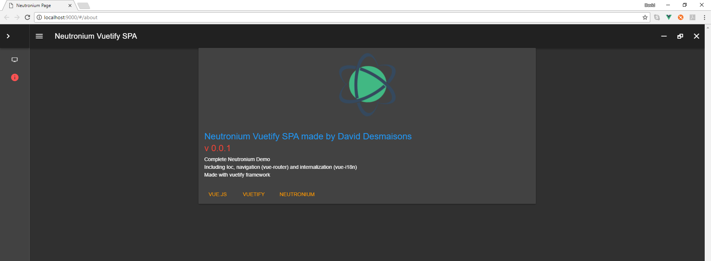
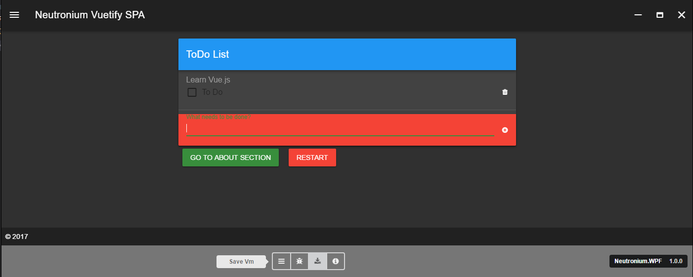

<p align="center"></p>
<h1 align="center">Neutronium.SPA.Demo</h1>

## Developing

Neutronium.SPA.Demo is based on [neutronium-vue](https://github.com/NeutroniumCore/neutronium-vue) vue-cli.

So you need to run `npm install` first time and `npm run dev` to open the view in the browser,

``` bash
# install dependencies
npm install

# serve with hot reload at localhost:9000
npm run dev
```

<br>


To open the page at a specific route, use the `-- --open-page=#\my-page` option:


``` bash
# serve with hot reload at localhost:9000 starting with page about
npm run dev -- --open-page=#/about
```
<br>


ViewModels:<br>
During development `vm.cjson` files are loaded as substitute viewModels.<br> By convention the viewModel corresponding to a page will be loaded from a folder with the same route name under the data folder.<br>
As such the folder structure is the following:


``` bash
├── data
│   ├── about
│   │   └── vm.cjson
│   └── main
│       └── vm.cjson
```

Regular JSON files are compatible with `.cjson` format, but the best way to generate `.cjson` files is to can use the `save Vm` button of Neutronium debug toolbar to save copy of "real" ViewModel:

<br>


To build the files for usage in Neutronium application, just run:
``` bash
# build files for usage in the C# application
npm run build
```


