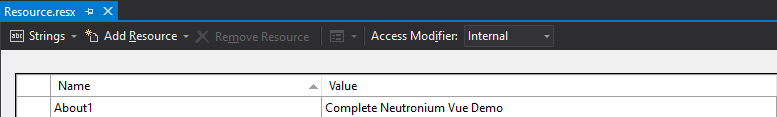

<p align="center"></p>
<h1 align="center">Neutronium.SPA.Demo</h1>

## Internalization

Resource.resx is used on the C# side and transformed by [message.tt](../Neutronium.SPA.Demo/View/Main/src/message.tt) into a `.json` file that is used by `vue-i18n` as resource.<br>

For example, to reference `About1` key defined as below:
<br>

Just do:

```HTML
<v-list-tile-title v-text="$t('Resource.About1')"></v-list-tile-title>
```

Back to [README](../README.md)

