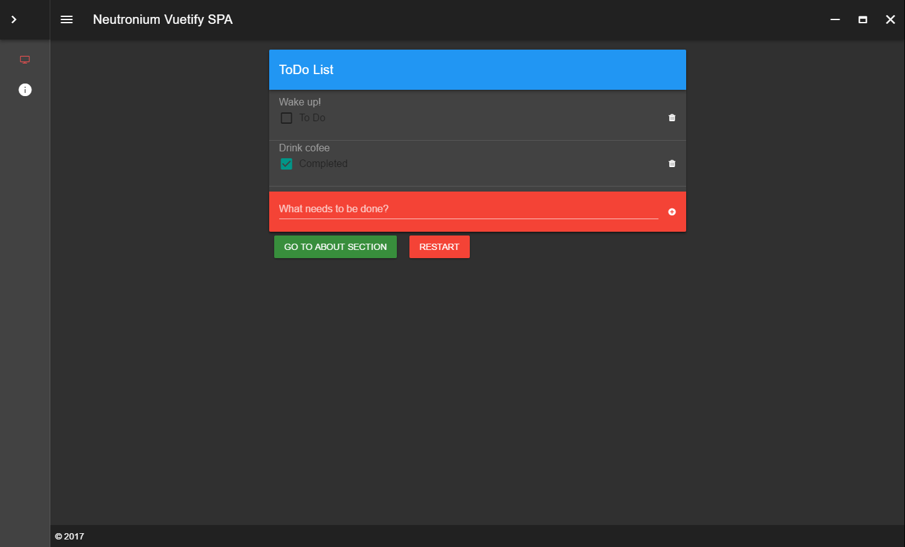

<p align="center"></p>
<h1 align="center">Neutronium.SPA.Demo</h1>


[](https://github.com/NeutroniumCore/Neutronium.SPA.Demo/blob/master/LICENSE)

## Description

This project is a demo application illustrating how it is possible to structure a medium to large project using [Neutronium](https://github.com/NeutroniumCore/Neutronium) and [Vue.js](https://vuejs.org) binding.

It can be used as a starter for building a new solution, or as a reference implementation for making a Neutronium application integrating:
* routing
* internalization
* chromeless window

It is built on the top of [Vuetifyjs](https://vuetifyjs.com) material component framework.


## Routing

### On the javascript side:
Routing is provided via an integration with [vue-router](https://router.vuejs.org/en/).

Only named route are used in this integration. Routes are declared in the javascript file: [routeDefinitions.js](./Neutronium.SPA.Demo/View/Main/src/routeDefinitions.js) :


```javascript
import main from './pages/main.vue'
import about from './pages/about.vue'

const routeDefinitions = [
    {name:'main', component: main, menu: {icon: 'fa-television'}},
    {name:'about', component: about,  menu: {icon: 'info'}}
]
```

Note that when route appears in the side menu, it should have a menu property with a icon value indicating which icon to display.

It is possible to use router-link to navigate to a given route providing its name. In this case, the viewModel to be display will be instanciated by the C# API described below.

## On the C# side

Navigation API provided in the `Neutronium.SPA.Demo.Application.Navigation` namespace allows to associate ViewModel type to specific route via the [`IRouterBuilder`](./Neutronium.SPA.Demo/Application/Navigation/IRouterBuilder.cs) interface.

This information is used by [`INavigator`]((./Neutronium.SPA.Demo/Application/Navigation/INavigator.cs)) interface implementation that allows to programmatically navigate.

```CSharp
    public interface INavigator
    {
        Task Navigate(object viewModel, string routeName = null);

        Task Navigate(string routeName);

        Task Navigate<T>(NavigationContext<T> context = null);

        Task Navigate(Type type, NavigationContext context = null);

        event EventHandler<RoutingEventArgs> OnNavigating;

        event EventHandler<RoutedEventArgs> OnNavigated;
    }
```

When navigation is done without providing a ViewModel instance, the ViewModel type (given as an argument, or inferred from the route name) is used by dependency injection mechanism to instanciate the corresponding ViewModel.


Finally:<br>
[RoutingConfiguration class](./Neutronium.SPA.Demo/App_start/RoutingConfiguration.cs) defines the convention for navigation: <br>
 all the types in the `Neutronium.SPA.Demo.ViewModel.Pages` namespace are associated with a route with name is the type without ViewModel postfix:

VM: `AboutViewModel` => route: `about`<br>
VM: `MainViewModel` => route: `main`

## Internalization

Integration with [vue-i18n](https://kazupon.github.io/vue-i18n/en/) is provided.

## Screenshots

<br>

<br>

<br>

<br>

<br>


## Built with

<p style="margin-left:100px;" align="">
<a href="https://vuetifyjs.com">

</a>
<a href="https://github.com/NeutroniumCore/Neutronium">

</a>
<a href="https://vuejs.org">

</a>
</p>


