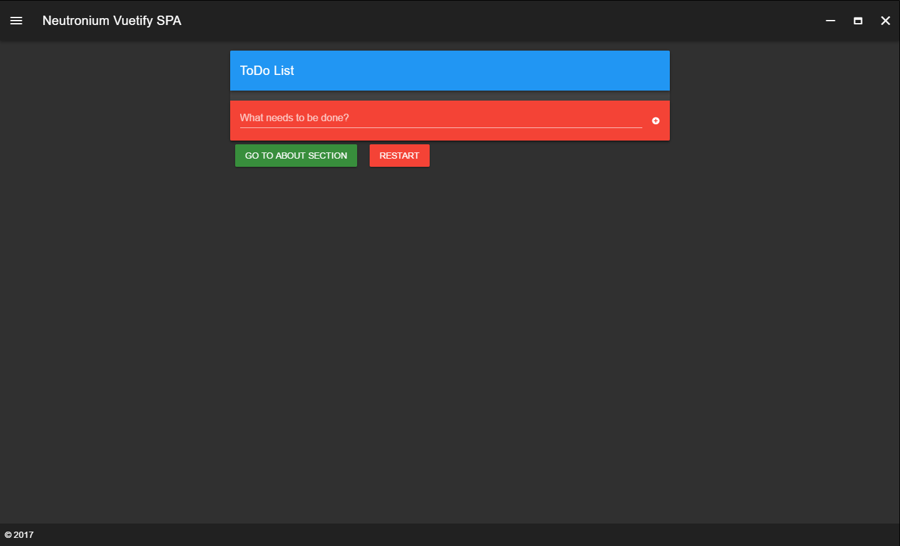
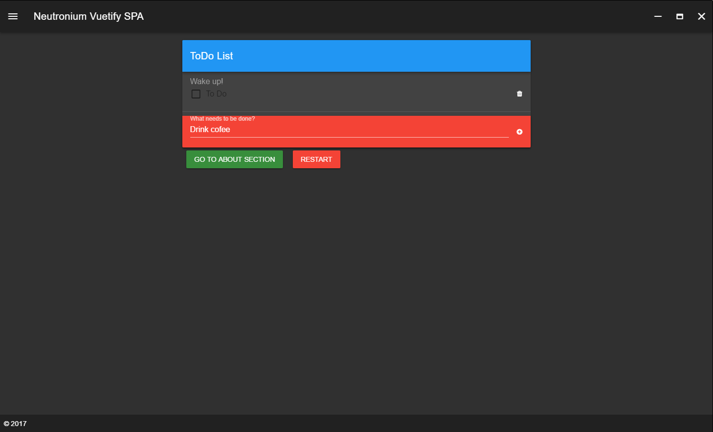
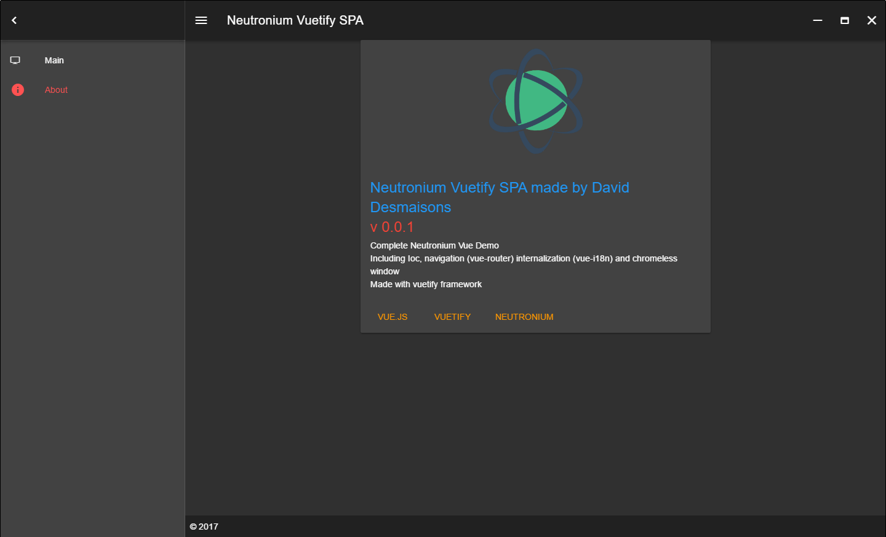

<h1 align="center">Neutronium.SPA.Demo</h1>

## Description

This project is a demo application illustrating how it is possible to structure a medium to large project using [Neutronium](https://github.com/NeutroniumCore/Neutronium) and [Vue.js](https://vuejs.org) binding.

It can be used as a starter for building a new solution, or as a reference Neutronium implementation regarding:
* routing
* internalization
* chromeless window
* dependency injection

It is built on the top of [Vuetifyjs](https://vuetifyjs.com) material component framework.

## Routing

Neutronium.SPA.Demo illustrates how to integrate with [vue-router](https://router.vuejs.org/en/). 
See more details [here](./Documentation/Routing.md)

## Internalization

Integration with [vue-i18n](https://kazupon.github.io/vue-i18n/en/) is provided. 
See more details [here](./Documentation/Internalization.md)

## Chromeless Window

See more details [here](./Documentation/Chromeless.md)

## Developing 

See more details [here](./Documentation/Developing.md)

## Screenshots

 

 

 

 

## Built with

